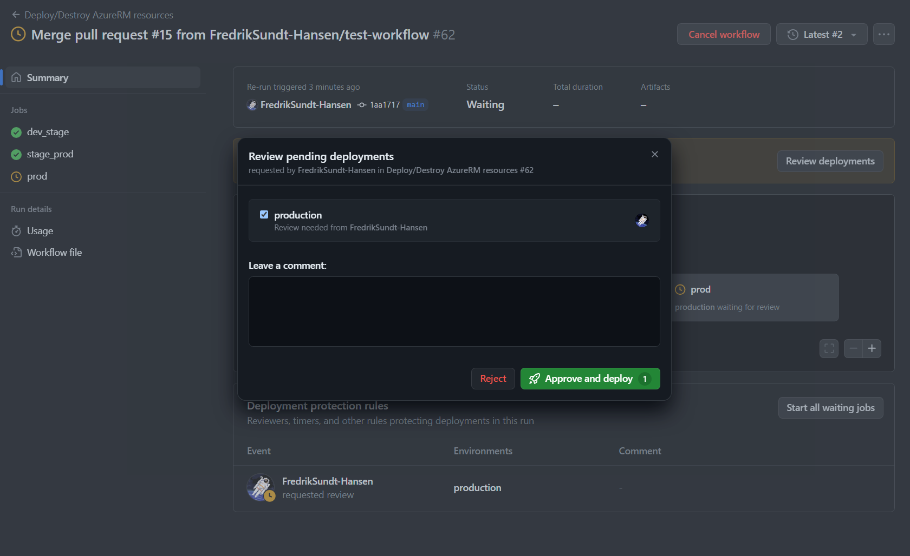

# Assigment 2

I used module 7 demo-infra as a base for this assignment. Since the focus was github actions. I removed the keyvault and virtualmachine module to make things a bit simpler, and then focus on the github actions parts. 

However, there was also other reasons to remove key vault and virtual machine module. I did not find any proper way to have no errors with tfsec and still use the key vault, as one have to use a network_acls block in the azurerm_key_vault resource to make sure that the key vault is not publicly available. 

```terraform
network_acls {
    default_action = "Deny"
    bypass         = "AzureServices"
    ip_rules       = ["ip address"]
  }
}
```

However, when we are running terraform in github actions we do not easily know the public ip of the runner. Thus, we cannot add this ip to the network_acls block. There are ways to come around this, but since this was not the focus of the assignment, I decided to remove the key vault module.

## How to use the Terraform scripts
There are two github actions workflows in this repository. One for applying AureRM resources with a pull request, and one for running tests if there are changes to the Terraform files. However, the first workflow can also be triggeret manually witha workflow_dispatch event to either apply manually or destroy manually. (It is the only way to destroy the resources.)

Pushing changes to any file within the Terraform folder will automatically trigger the 'testvalidate.yml' workflow. 

This worflow will run Terraform init, Terraform fmt with check, Terraform validate, tflint and tfsec. '

When the changes in the branch has been approved by the worflow, one can then merge the changes to the main by merging the pull request. 

When the changes has been merged to the main branch, the 'apply.yml' workflow will be triggered. There will be three different deployments, one for dev, one for stage and one for production. 

However, the production deployment will only be triggered if the stage deployment is successful, and the stage deployment will only be triggered if the dev deployment is successful. 

Furthermore, the production has to be reviewed by a reviewer before it can be deployed. 

## Terraform vars
Instead of adding variables as string in the worflow files, we can instead just use the default in the Terraform variables. 

Thus, there is no need to add variables in the workflow files, and no need for a .tfvars file. 

### Screenshots
This is an example on how the github actions workflow looks like when it is running.

First we begin in branch main. As seen under. 


Then we need make some changes to any of the terraform files. 

First we need to create a new branch. Let's call it test-workflow. Just to demonstrate. 


The we make some chanes to the main.tf file. 


Then we commit the changes and push to the new branch. 


Then we create a pull request. This can either be done in the browser, or with the github cli. However, here we will do it in the browser since it is easier to demonstrate. 


Now the new chanes has been pushed to the new branch, and a pull request has been created. Furthremore, the 'testvalidate.yml' workflow has been triggered and everything is green. 

We can also see this in the actions tab in github.


As one can see, all the tests were successful. 

Now we can merge the pull request to the main branch.


And lastly, we delete the branch. 


Now the changes has been merged to the main branch, and the 'apply.yml' workflow will be triggered.


When the different stages are finished (dev, and stage) then there will be a request to a reviewer. In this case this is me, and you can see on the picture below that I need to approve the changes before the workflow can continue. 


Approval of the changes.



The production workflow will now be triggered.


And when the production workflow is finished, the resources will be deployed.


Finally we can also check this in the Azure portal.


Dev resource group succesfully deployed.

