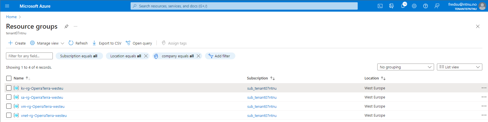

# IaC-mandatory-assigment-1

This is the first mandatory assigment where the goal was to develope a reusable Terraform project that uses modules to provision and manage different Azure resources. This implementation consists of one root module, and four child modules. The root module is used to call and manage the child modules, and the child modules are used to provision different Azure resources. The child modules are strctured so that only the resources relevant for that modules purpose is provisioned. For example, the virtual machine module only provisions the resources needed to create a virtual machine.

The root module consits of the following files:
1. main.tf: This is the main file that calls the child modules and passes the variables to them.
1. variables.tf: This file contains the variables that are passed to the child modules.
1. outputs.tf: Contains outputs from child modules that are outputted when the root module is applied. Like the public IP address of the virtual machine.
1. terraform.tfvars: This file contains the values for the variables that are passed to the child modules.
1. provider.tf: This file contains the provider information. In this case the Azure provider.
1. locals.tf: This file contains local variables that are used in the root module. Here it used as tags, company name and project name tags that are used in the child modules.

The child modules each contain a main.tf file, which is named after module. For example, the virtual machine module has the main.tf file as vm_module.tf. Then here are the variables.tf file for all the terraform variables, and the the outputs.tf file for all the outputs for that module. 

### The different Azure resources used in the implementation
- Azurerm Resource Group
- Virtual network module: 
    - Azurerm Virtual Network
    - Azurerm Network Security Group
    - Azurerm Subnet
    - Azurerm Network Security Rule
    - Azurerm Subnet Network Security Group Association  
- Virtual machine module:
    - Azurerm Virtual Machine
    - Azurerm Network Interface
    - Azurerm Public IP
    - Azurerm Managed Disk
    - Azurerm Virtual Machine Extension
- Storage account module:
    - Azurerm Storage Account
    - Azurerm Storage Container
    - Azurerm Storage Blob
    - Azurerm Storage Queue
    - Azurerm Storage Queue Message
    - Azurerm Storage Table
    - Azurerm Storage Table Entity
- Key vault module:
    - Azurerm Key Vault
    - Azurerm Key Vault Secret  

## The purpose of each module

### Virtual network module
The purpose of the virtual network module is to create a virtual network with a subnet and a network security group. The network security group is used to control the traffic to and from the virtual network. 

The module also creates a network security rule that allows traffic from the internet to the virtual network. Here a SSH inbound rule is created that allows traffic from the source address specified in the `terraform.tfvars` file. The source address is the public IP address of the local machine.

The virtual network allows a user with the right source address to connect to the virtual machine using ssh. 

### Virtual machine module
The purpose of the virtual machine module is to create a virtual machine with a public IP address, a network interface, a managed disk and a virtual machine extension. The virtual machine network interface uses the subnet id from the virtual network subnet. Thus, the virtual machine is connected to the virtual network. 

### Storage account module
A storage account contains all Azure Storage data objects. Here it only contains one storace container. The storage account access key is in a key vault secret. 

### Key vault module
The key vault serves the purpose of storing Storage Account Access Keys and virtual machine login credentials. The vm username from the .tfvars file and password declared in the command line (see step 2. in How to use the Terraform script) are stored in the key vault secrets are outputted to the virtual machine module, to the variables `vm_username` and `vm_password`. Therefore, the virtual machine login credentials, username and password, are the same as the value in the key vault secret. 

## How to use the Terraform script
1. run `terraform init` to initialize the Terraform project.
1. run `terraform plan --out=main.tfplan:` to create a plan for the Terraform project. Then Terraform will ask aobut the variable `vm_password` which is the password for the virtual machine. The password must have lower characters, upper characters, a digit, and a special character other than "_". Alternatively, the variable can be set using the variable option in the command line interface: `--var vm_password="YOUR_PASSWORD`.
1. run `terraform apply "main.tfplan"` to apply the plan and create the resources. Public ip for the virtual machine and and source address for the inound ssh rule will be outputted when the plan is applied. 

    The public ip is used to connect to the virtual machine using ssh. The source address is used to restrict the inbound ssh rule to only allow traffic from the local machine. The source address can be changed in the `terraform.tfvars` file.
1. Connect to the virtual machine using ssh: `ssh OperraTerra@PUBLIC_IP`. The password is the password that was set in step 2. 
1. Destroy the resources by running `terraform destroy` and answering yes when Terraform asks for confirmation. 

## Output screenshot showing a successful Terraform plan, apply and destroy

### Terraform plan

```
PS C:\Users\fredr\OneDrive\NTNU\infrastructure_as_code\IaC-mandatory-assignments\assignment_1\terraform> terraform plan --out=main.tfplan --var vm_password="Password123!"
module.key_vault.data.azurerm_client_config.current: Reading...
module.key_vault.data.azurerm_client_config.current: Read complete after 0s [id=Y2xpZW50Q29uZmlncy9jbGllbnRJZD0wNGIwNzc5NS04ZGRiLTQ2MWEtYmJlZS0wMmY5ZTFiZjdiNDY7b2JqZWN0SWQ9ZDY5OWIyYTUtYjJlOC00YWU3LTlkNjAtN2IzMTY4MzcxZWJkO3N1YnNjcmlwdGlvbklkPTQ4MzJiZGQ5LWM1NjgtNDk3Zi1hZjQyLTNjNDVkMWUxNmVmNjt0ZW5hbnRJZD0wNDE0MTgzNy1hMTNhLTQzYjYtYTQyYy00OTU2NzlmZjhkZTE=]

Terraform used the selected providers to generate the following execution plan.
Resource actions are indicated with the following symbols:
  + create
 <= read (data resources)

Terraform will perform the following actions:

  # random_string.random_string_name will be created
  + resource "random_string" "random_string_name" {
      + id          = (known after apply)
      + length      = 10
      + lower       = true
      + min_lower   = 0
      + min_numeric = 0
      + min_special = 0
      + min_upper   = 0
      + number      = true
      + numeric     = true
      + result      = (known after apply)
      + special     = false
      + upper       = false
    }

  # module.key_vault.data.azurerm_key_vault_secret.vm_credentials will be read during apply
  # (config refers to values not yet known)
 <= data "azurerm_key_vault_secret" "vm_credentials" {
      + content_type            = (known after apply)
      + expiration_date         = (known after apply)
      + id                      = (known after apply)
      + key_vault_id            = (known after apply)
      + name                    = "kvs-OperaTerra-login"
      + not_before_date         = (known after apply)
      + resource_id             = (known after apply)
      + resource_versionless_id = (known after apply)
      + tags                    = (known after apply)
      + value                   = (sensitive value)
      + versionless_id          = (known after apply)
    }

  # module.key_vault.azurerm_key_vault.kv will be created
  + resource "azurerm_key_vault" "kv" {
      + access_policy                 = [
          + {
              + key_permissions     = [
                  + "Get",
                  + "List",
                  + "Create",
                ]
              + object_id           = "d699b2a5-b2e8-4ae7-9d60-7b3168371ebd"      
              + secret_permissions  = [
                  + "Get",
                  + "Set",
                  + "List",
                ]
              + storage_permissions = [
                  + "Get",
                  + "Set",
                  + "List",
                ]
              + tenant_id           = "04141837-a13a-43b6-a42c-495679ff8de1"      
            },
        ]
      + enabled_for_disk_encryption   = true
      + id                            = (known after apply)
      + location                      = "westeurope"
      + name                          = (known after apply)
      + public_network_access_enabled = true
      + purge_protection_enabled      = false
      + resource_group_name           = "kv-rg-OperraTerra-westeu"
      + sku_name                      = "premium"
      + soft_delete_retention_days    = 7
      + tags                          = {
          + "company" = "OperraTerraAS"
          + "project" = "OperraTerraAS-mandatory-assignment-1"
        }
      + tenant_id                     = "04141837-a13a-43b6-a42c-495679ff8de1"    
      + vault_uri                     = (known after apply)
    }

  # module.key_vault.azurerm_key_vault_secret.kvs_sa_accesskey will be created    
  + resource "azurerm_key_vault_secret" "kvs_sa_accesskey" {
      + id                      = (known after apply)
      + key_vault_id            = (known after apply)
      + name                    = "kvs-OperaTerra-accesskey"
      + resource_id             = (known after apply)
      + resource_versionless_id = (known after apply)
      + value                   = (sensitive value)
      + version                 = (known after apply)
      + versionless_id          = (known after apply)
    }

  # module.key_vault.azurerm_key_vault_secret.kvs_vm_credentials will be created  
  + resource "azurerm_key_vault_secret" "kvs_vm_credentials" {
      + id                      = (known after apply)
      + key_vault_id            = (known after apply)
      + name                    = "kvs-OperaTerra-login"
      + resource_id             = (known after apply)
      + resource_versionless_id = (known after apply)
      + value                   = (sensitive value)
      + version                 = (known after apply)
      + versionless_id          = (known after apply)
    }

  # module.key_vault.azurerm_resource_group.kv_rg will be created
  + resource "azurerm_resource_group" "kv_rg" {
      + id       = (known after apply)
      + location = "westeurope"
      + name     = "kv-rg-OperraTerra-westeu"
      + tags     = {
          + "company" = "OperraTerraAS"
          + "project" = "OperraTerraAS-mandatory-assignment-1"
        }
    }

  # module.storage_account.azurerm_resource_group.sa_rg will be created
  + resource "azurerm_resource_group" "sa_rg" {
      + id       = (known after apply)
      + location = "westeurope"
      + name     = "sa-rg-OperraTerra-westeu"
      + tags     = {
          + "company" = "OperraTerraAS"
          + "project" = "OperraTerraAS-mandatory-assignment-1"
        }
    }

  # module.storage_account.azurerm_storage_account.sa will be created
  + resource "azurerm_storage_account" "sa" {
      + access_tier                       = (known after apply)
      + account_kind                      = "StorageV2"
      + account_replication_type          = "GRS"
      + account_tier                      = "Standard"
      + allow_nested_items_to_be_public   = true
      + cross_tenant_replication_enabled  = true
      + default_to_oauth_authentication   = false
      + enable_https_traffic_only         = true
      + id                                = (known after apply)
      + infrastructure_encryption_enabled = false
      + is_hns_enabled                    = false
      + large_file_share_enabled          = (known after apply)
      + location                          = "westeurope"
      + min_tls_version                   = "TLS1_2"
      + name                              = (known after apply)
      + nfsv3_enabled                     = false
      + primary_access_key                = (sensitive value)
      + primary_blob_connection_string    = (sensitive value)
      + primary_blob_endpoint             = (known after apply)
      + primary_blob_host                 = (known after apply)
      + primary_connection_string         = (sensitive value)
      + primary_dfs_endpoint              = (known after apply)
      + primary_dfs_host                  = (known after apply)
      + primary_file_endpoint             = (known after apply)
      + primary_file_host                 = (known after apply)
      + primary_location                  = (known after apply)
      + primary_queue_endpoint            = (known after apply)
      + primary_queue_host                = (known after apply)
      + primary_table_endpoint            = (known after apply)
      + primary_table_host                = (known after apply)
      + primary_web_endpoint              = (known after apply)
      + primary_web_host                  = (known after apply)
      + public_network_access_enabled     = true
      + queue_encryption_key_type         = "Service"
      + resource_group_name               = "sa-rg-OperraTerra-westeu"
      + secondary_access_key              = (sensitive value)
      + secondary_blob_connection_string  = (sensitive value)
      + secondary_blob_endpoint           = (known after apply)
      + secondary_blob_host               = (known after apply)
      + secondary_connection_string       = (sensitive value)
      + secondary_dfs_endpoint            = (known after apply)
      + secondary_dfs_host                = (known after apply)
      + secondary_file_endpoint           = (known after apply)
      + secondary_file_host               = (known after apply)
      + secondary_location                = (known after apply)
      + secondary_queue_endpoint          = (known after apply)
      + secondary_queue_host              = (known after apply)
      + secondary_table_endpoint          = (known after apply)
      + secondary_table_host              = (known after apply)
      + secondary_web_endpoint            = (known after apply)
      + secondary_web_host                = (known after apply)
      + sftp_enabled                      = false
      + shared_access_key_enabled         = true
      + table_encryption_key_type         = "Service"
      + tags                              = {
          + "company" = "OperraTerraAS"
          + "project" = "OperraTerraAS-mandatory-assignment-1"
        }
    }

  # module.storage_account.azurerm_storage_container.sc will be created
  + resource "azurerm_storage_container" "sc" {
      + container_access_type   = "private"
      + has_immutability_policy = (known after apply)
      + has_legal_hold          = (known after apply)
      + id                      = (known after apply)
      + metadata                = (known after apply)
      + name                    = "scoperraterra"
      + resource_manager_id     = (known after apply)
      + storage_account_name    = (known after apply)
    }

  # module.storage_account.random_string.random will be created
  + resource "random_string" "random" {
      + id          = (known after apply)
      + length      = 10
      + lower       = true
      + min_lower   = 0
      + min_numeric = 0
      + min_special = 0
      + min_upper   = 0
      + number      = true
      + numeric     = true
      + result      = (known after apply)
      + special     = false
      + upper       = false
    }

  # module.virtual_machine.azurerm_linux_virtual_machine.vm_linux will be created 
  + resource "azurerm_linux_virtual_machine" "vm_linux" {
      + admin_password                                         = (sensitive value)
      + admin_username                                         = (sensitive value)
      + allow_extension_operations                             = true
      + bypass_platform_safety_checks_on_user_schedule_enabled = false
      + computer_name                                          = (known after apply)
      + disable_password_authentication                        = false
      + extensions_time_budget                                 = "PT1H30M"        
      + id                                                     = (known after apply)
      + location                                               = "westeurope"     
      + max_bid_price                                          = -1
      + name                                                   = "vm-linux-OperaTerra"
      + network_interface_ids                                  = (known after apply)
      + patch_assessment_mode                                  = "ImageDefault"   
      + patch_mode                                             = "ImageDefault"   
      + platform_fault_domain                                  = -1
      + priority                                               = "Regular"        
      + private_ip_address                                     = (known after apply)
      + private_ip_addresses                                   = (known after apply)
      + provision_vm_agent                                     = true
      + public_ip_address                                      = (known after apply)
      + public_ip_addresses                                    = (known after apply)
      + resource_group_name                                    = "vm-rg-OperraTerra-westeu"
      + size                                                   = "Standard_B1s"   
      + tags                                                   = {
          + "company" = "OperraTerraAS"
          + "project" = "OperraTerraAS-mandatory-assignment-1"
        }
      + virtual_machine_id                                     = (known after apply)

      + os_disk {
          + caching                   = "ReadWrite"
          + disk_size_gb              = (known after apply)
          + name                      = (known after apply)
          + storage_account_type      = "Standard_LRS"
          + write_accelerator_enabled = false
        }

      + source_image_reference {
          + offer     = "0001-com-ubuntu-server-focal"
          + publisher = "Canonical"
          + sku       = "20_04-lts"
          + version   = "latest"
        }
    }

  # module.virtual_machine.azurerm_network_interface.vm_nic will be created       
  + resource "azurerm_network_interface" "vm_nic" {
      + applied_dns_servers           = (known after apply)
      + dns_servers                   = (known after apply)
      + enable_accelerated_networking = false
      + enable_ip_forwarding          = false
      + id                            = (known after apply)
      + internal_dns_name_label       = (known after apply)
      + internal_domain_name_suffix   = (known after apply)
      + location                      = "westeurope"
      + mac_address                   = (known after apply)
      + name                          = "vm-nic-OperaTerra"
      + private_ip_address            = (known after apply)
      + private_ip_addresses          = (known after apply)
      + resource_group_name           = "vm-rg-OperraTerra-westeu"
      + tags                          = {
          + "company" = "OperraTerraAS"
          + "project" = "OperraTerraAS-mandatory-assignment-1"
        }
      + virtual_machine_id            = (known after apply)

      + ip_configuration {
          + gateway_load_balancer_frontend_ip_configuration_id = (known after apply)
          + name                                               = "internal"       
          + primary                                            = (known after apply)
          + private_ip_address                                 = (known after apply)
          + private_ip_address_allocation                      = "Dynamic"        
          + private_ip_address_version                         = "IPv4"
          + public_ip_address_id                               = (known after apply)
          + subnet_id                                          = (known after apply)
        }
    }

  # module.virtual_machine.azurerm_public_ip.vm_pub_ip will be created
  + resource "azurerm_public_ip" "vm_pub_ip" {
      + allocation_method       = "Static"
      + ddos_protection_mode    = "VirtualNetworkInherited"
      + fqdn                    = (known after apply)
      + id                      = (known after apply)
      + idle_timeout_in_minutes = 4
      + ip_address              = (known after apply)
      + ip_version              = "IPv4"
      + location                = "westeurope"
      + name                    = "vm-pub-ip-OperaTerra"
      + resource_group_name     = "vm-rg-OperraTerra-westeu"
      + sku                     = "Basic"
      + sku_tier                = "Regional"
      + tags                    = {
          + "company" = "OperraTerraAS"
          + "project" = "OperraTerraAS-mandatory-assignment-1"
        }
    }

  # module.virtual_machine.azurerm_resource_group.vm_rg will be created
  + resource "azurerm_resource_group" "vm_rg" {
      + id       = (known after apply)
      + location = "westeurope"
      + name     = "vm-rg-OperraTerra-westeu"
      + tags     = {
          + "company" = "OperraTerraAS"
          + "project" = "OperraTerraAS-mandatory-assignment-1"
        }
    }

  # module.virtual_network.azurerm_network_security_group.nsg will be created     
  + resource "azurerm_network_security_group" "nsg" {
      + id                  = (known after apply)
      + location            = "westeurope"
      + name                = "nsg-OperaTerra"
      + resource_group_name = "vnet-rg-OperraTerra-westeu"
      + security_rule       = (known after apply)
      + tags                = {
          + "company" = "OperraTerraAS"
          + "project" = "OperraTerraAS-mandatory-assignment-1"
        }
    }

  # module.virtual_network.azurerm_network_security_rule.ssh_inbound_myIP will be created
  + resource "azurerm_network_security_rule" "ssh_inbound_myIP" {
      + access                      = "Allow"
      + destination_address_prefix  = "*"
      + destination_port_range      = "*"
      + direction                   = "Inbound"
      + id                          = (known after apply)
      + name                        = "ssh_inbound_MyIP"
      + network_security_group_name = "nsg-OperaTerra"
      + priority                    = 100
      + protocol                    = "Tcp"
      + resource_group_name         = "vnet-rg-OperraTerra-westeu"
      + source_address_prefix       = "88.95.188.113"
      + source_port_range           = "*"
    }

  # module.virtual_network.azurerm_resource_group.vnet_rg will be created
  + resource "azurerm_resource_group" "vnet_rg" {
      + id       = (known after apply)
      + location = "westeurope"
      + name     = "vnet-rg-OperraTerra-westeu"
      + tags     = {
          + "company" = "OperraTerraAS"
          + "project" = "OperraTerraAS-mandatory-assignment-1"
        }
    }

  # module.virtual_network.azurerm_subnet.subnet_vm will be created
  + resource "azurerm_subnet" "subnet_vm" {
      + address_prefixes                               = [
          + "10.0.1.0/24",
        ]
      + enforce_private_link_endpoint_network_policies = (known after apply)      
      + enforce_private_link_service_network_policies  = (known after apply)      
      + id                                             = (known after apply)      
      + name                                           = "subnet-vm-OperaTerra"   
      + private_endpoint_network_policies_enabled      = (known after apply)      
      + private_link_service_network_policies_enabled  = (known after apply)      
      + resource_group_name                            = "vnet-rg-OperraTerra-westeu"
      + virtual_network_name                           = "vnet-OperaTerra"        
    }

  # module.virtual_network.azurerm_subnet_network_security_group_association.nsg_association will be created
  + resource "azurerm_subnet_network_security_group_association" "nsg_association" {
      + id                        = (known after apply)
      + network_security_group_id = (known after apply)
      + subnet_id                 = (known after apply)
    }

  # module.virtual_network.azurerm_virtual_network.vnet will be created
  + resource "azurerm_virtual_network" "vnet" {
      + address_space       = [
          + "10.0.0.0/16",
        ]
      + dns_servers         = [
          + "10.0.0.4",
          + "10.0.0.5",
        ]
      + guid                = (known after apply)
      + id                  = (known after apply)
      + location            = "westeurope"
      + name                = "vnet-OperaTerra"
      + resource_group_name = "vnet-rg-OperraTerra-westeu"
      + subnet              = (known after apply)
      + tags                = {
          + "company" = "OperraTerraAS"
          + "project" = "OperraTerraAS-mandatory-assignment-1"
        }
    }

Plan: 19 to add, 0 to change, 0 to destroy.

Changes to Outputs:
  + source_address_prefix_output = "88.95.188.113"
  + vm_pub_ip_output             = (known after apply)

───────────────────────────────────────────────────────────────────────────────── 

Saved the plan to: main.tfplan

To perform exactly these actions, run the following command to apply:
    terraform apply "main.tfplan"
```

### Terraform apply
````
PS C:\Users\fredr\OneDrive\NTNU\infrastructure_as_code\IaC-mandatory-assignments\assignment_1\terraform>                                                            
                       terraform apply "main.tfplan"                              
random_string.random_string_name: Creating...
module.storage_account.random_string.random: Creating...
random_string.random_string_name: Creation complete after 0s [id=8uo2nuuh8n]      
module.storage_account.random_string.random: Creation complete after 0s [id=iwlhju050y]
module.virtual_machine.azurerm_resource_group.vm_rg: Creating...
module.key_vault.azurerm_resource_group.kv_rg: Creating...
module.virtual_network.azurerm_resource_group.vnet_rg: Creating...
module.storage_account.azurerm_resource_group.sa_rg: Creating...
module.key_vault.azurerm_resource_group.kv_rg: Creation complete after 1s [id=/subscriptions/4832bdd9-c568-497f-af42-3c45d1e16ef6/resourceGroups/kv-rg-OperraTerra-westeu]
module.storage_account.azurerm_resource_group.sa_rg: Creation complete after 1s [id=/subscriptions/4832bdd9-c568-497f-af42-3c45d1e16ef6/resourceGroups/sa-rg-OperraTerra-westeu]
module.key_vault.azurerm_key_vault.kv: Creating...
module.storage_account.azurerm_storage_account.sa: Creating...
module.virtual_network.azurerm_resource_group.vnet_rg: Creation complete after 1s [id=/subscriptions/4832bdd9-c568-497f-af42-3c45d1e16ef6/resourceGroups/vnet-rg-OperraTerra-westeu]
module.virtual_machine.azurerm_resource_group.vm_rg: Creation complete after 1s [id=/subscriptions/4832bdd9-c568-497f-af42-3c45d1e16ef6/resourceGroups/vm-rg-OperraTerra-westeu]
module.virtual_network.azurerm_network_security_group.nsg: Creating...
module.virtual_network.azurerm_virtual_network.vnet: Creating...
module.virtual_machine.azurerm_public_ip.vm_pub_ip: Creating...
module.virtual_network.azurerm_network_security_group.nsg: Creation complete after 2s [id=/subscriptions/4832bdd9-c568-497f-af42-3c45d1e16ef6/resourceGroups/vnet-rg-OperraTerra-westeu/providers/Microsoft.Network/networkSecurityGroups/nsg-OperaTerra]
module.virtual_network.azurerm_network_security_rule.ssh_inbound_myIP: Creating...
module.virtual_machine.azurerm_public_ip.vm_pub_ip: Creation complete after 2s [id=/subscriptions/4832bdd9-c568-497f-af42-3c45d1e16ef6/resourceGroups/vm-rg-OperraTerra-westeu/providers/Microsoft.Network/publicIPAddresses/vm-pub-ip-OperaTerra]    
module.virtual_network.azurerm_network_security_rule.ssh_inbound_myIP: Creation complete after 2s [id=/subscriptions/4832bdd9-c568-497f-af42-3c45d1e16ef6/resourceGroups/vnet-rg-OperraTerra-westeu/providers/Microsoft.Network/networkSecurityGroups/nsg-OperaTerra/securityRules/ssh_inbound_MyIP]
module.virtual_network.azurerm_virtual_network.vnet: Creation complete after 5s [id=/subscriptions/4832bdd9-c568-497f-af42-3c45d1e16ef6/resourceGroups/vnet-rg-OperraTerra-westeu/providers/Microsoft.Network/virtualNetworks/vnet-OperaTerra]        
module.virtual_network.azurerm_subnet.subnet_vm: Creating...
module.virtual_network.azurerm_subnet.subnet_vm: Creation complete after 4s [id=/subscriptions/4832bdd9-c568-497f-af42-3c45d1e16ef6/resourceGroups/vnet-rg-OperraTerra-westeu/providers/Microsoft.Network/virtualNetworks/vnet-OperaTerra/subnets/subnet-vm-OperaTerra]
module.virtual_network.azurerm_subnet_network_security_group_association.nsg_association: Creating...
module.virtual_machine.azurerm_network_interface.vm_nic: Creating...
module.key_vault.azurerm_key_vault.kv: Still creating... [10s elapsed]
module.storage_account.azurerm_storage_account.sa: Still creating... [10s elapsed]
module.virtual_network.azurerm_subnet_network_security_group_association.nsg_association: Creation complete after 5s [id=/subscriptions/4832bdd9-c568-497f-af42-3c45d1e16ef6/resourceGroups/vnet-rg-OperraTerra-westeu/providers/Microsoft.Network/virtualNetworks/vnet-OperaTerra/subnets/subnet-vm-OperaTerra]
module.virtual_machine.azurerm_network_interface.vm_nic: Still creating... [10s elapsed]
module.key_vault.azurerm_key_vault.kv: Still creating... [20s elapsed]
module.storage_account.azurerm_storage_account.sa: Still creating... [20s elapsed]
module.virtual_machine.azurerm_network_interface.vm_nic: Creation complete after 16s [id=/subscriptions/4832bdd9-c568-497f-af42-3c45d1e16ef6/resourceGroups/vm-rg-OperraTerra-westeu/providers/Microsoft.Network/networkInterfaces/vm-nic-OperaTerra] 
module.storage_account.azurerm_storage_account.sa: Creation complete after 26s [id=/subscriptions/4832bdd9-c568-497f-af42-3c45d1e16ef6/resourceGroups/sa-rg-OperraTerra-westeu/providers/Microsoft.Storage/storageAccounts/saoperraterra8uo2nuuh8n]   
module.storage_account.azurerm_storage_container.sc: Creating...
module.storage_account.azurerm_storage_container.sc: Creation complete after 0s [id=https://saoperraterra8uo2nuuh8n.blob.core.windows.net/scoperraterra]
module.key_vault.azurerm_key_vault.kv: Still creating... [30s elapsed]
module.key_vault.azurerm_key_vault.kv: Still creating... [40s elapsed]
module.key_vault.azurerm_key_vault.kv: Still creating... [50s elapsed]
module.key_vault.azurerm_key_vault.kv: Still creating... [1m0s elapsed]
module.key_vault.azurerm_key_vault.kv: Still creating... [1m10s elapsed]
module.key_vault.azurerm_key_vault.kv: Still creating... [1m20s elapsed]
module.key_vault.azurerm_key_vault.kv: Still creating... [1m30s elapsed]
module.key_vault.azurerm_key_vault.kv: Still creating... [1m40s elapsed]
module.key_vault.azurerm_key_vault.kv: Still creating... [1m50s elapsed]
module.key_vault.azurerm_key_vault.kv: Still creating... [2m0s elapsed]
module.key_vault.azurerm_key_vault.kv: Still creating... [2m10s elapsed]
module.key_vault.azurerm_key_vault.kv: Still creating... [2m20s elapsed]
module.key_vault.azurerm_key_vault.kv: Still creating... [2m30s elapsed]
module.key_vault.azurerm_key_vault.kv: Still creating... [2m40s elapsed]
module.key_vault.azurerm_key_vault.kv: Creation complete after 2m42s [id=/subscriptions/4832bdd9-c568-497f-af42-3c45d1e16ef6/resourceGroups/kv-rg-OperraTerra-westeu/providers/Microsoft.KeyVault/vaults/kv-operaterra8uo2nuuh8n]
module.key_vault.azurerm_key_vault_secret.kvs_sa_accesskey: Creating...
module.key_vault.azurerm_key_vault_secret.kvs_vm_credentials: Creating...
module.key_vault.azurerm_key_vault_secret.kvs_sa_accesskey: Creation complete after 1s [id=https://kv-operaterra8uo2nuuh8n.vault.azure.net/secrets/kvs-OperaTerra-accesskey/ce81c052219140c480af0917a45feecd]
module.key_vault.azurerm_key_vault_secret.kvs_vm_credentials: Creation complete after 1s [id=https://kv-operaterra8uo2nuuh8n.vault.azure.net/secrets/kvs-OperaTerra-login/b5d35ad0bd134f48a8acee85272886df]
module.key_vault.data.azurerm_key_vault_secret.vm_credentials: Reading...
module.key_vault.data.azurerm_key_vault_secret.vm_credentials: Read complete after 0s [id=https://kv-operaterra8uo2nuuh8n.vault.azure.net/secrets/kvs-OperaTerra-login/b5d35ad0bd134f48a8acee85272886df]
module.virtual_machine.azurerm_linux_virtual_machine.vm_linux: Creating...        
module.virtual_machine.azurerm_linux_virtual_machine.vm_linux: Still creating... [10s elapsed]
module.virtual_machine.azurerm_linux_virtual_machine.vm_linux: Still creating... [20s elapsed]
module.virtual_machine.azurerm_linux_virtual_machine.vm_linux: Creation complete after 22s [id=/subscriptions/4832bdd9-c568-497f-af42-3c45d1e16ef6/resourceGroups/vm-rg-OperraTerra-westeu/providers/Microsoft.Compute/virtualMachines/vm-linux-OperaTerra]

Apply complete! Resources: 19 added, 0 changed, 0 destroyed.

Outputs:

source_address_prefix_output = "88.95.188.113"
vm_pub_ip_output = "40.68.27.54"
````


### Terraform destroy
Had to delete the key vault manually to avoid 403 error, since it does not allow me to destroy the key vault secrets. The only fix I found was deleting the key vault manually. Therefore, there are only 16 resources destroyed in the output.

```
PS C:\Users\fredr\OneDrive\NTNU\infrastructure_as_code\IaC-mandatory-assignments\assignment_1\terraform> terraform destroy --var vm_password="Password123!"
random_string.random_string_name: Refreshing state... [id=96l8k4ovah]
module.storage_account.random_string.random: Refreshing state... [id=j1fwgljx1k]
module.storage_account.azurerm_resource_group.sa_rg: Refreshing state... [id=/subscriptions/4832bdd9-c568-497f-af42-3c45d1e16ef6/resourceGroups/sa-rg-OperraTerra-westeu]
module.virtual_machine.azurerm_resource_group.vm_rg: Refreshing state... [id=/subscriptions/4832bdd9-c568-497f-af42-3c45d1e16ef6/resourceGroups/vm-rg-OperraTerra-westeu]
module.key_vault.data.azurerm_client_config.current: Reading...
module.key_vault.azurerm_resource_group.kv_rg: Refreshing state... [id=/subscriptions/4832bdd9-c568-497f-af42-3c45d1e16ef6/resourceGroups/kv-rg-OperraTerra-westeu]
module.virtual_network.azurerm_resource_group.vnet_rg: Refreshing state... [id=/subscriptions/4832bdd9-c568-497f-af42-3c45d1e16ef6/resourceGroups/vnet-rg-OperraTerra-westeu]
module.key_vault.data.azurerm_client_config.current: Read complete after 0s [id=Y2xpZW50Q29uZmlncy9jbGllbnRJZD0wNGIwNzc5NS04ZGRiLTQ2MWEtYmJlZS0wMmY5ZTFiZjdiNDY7b2JqZWN0SWQ9ZDY5OWIyYTUtYjJlOC00YWU3LTlkNjAtN2IzMTY4MzcxZWJkO3N1YnNjcmlwdGlvbklkPTQ4MzJiZGQ5LWM1NjgtNDk3Zi1hZjQyLTNjNDVkMWUxNmVmNjt0ZW5hbnRJZD0wNDE0MTgzNy1hMTNhLTQzYjYtYTQyYy00OTU2NzlmZjhkZTE=]
module.virtual_machine.azurerm_public_ip.vm_pub_ip: Refreshing state... [id=/subscriptions/4832bdd9-c568-497f-af42-3c45d1e16ef6/resourceGroups/vm-rg-OperraTerra-westeu/providers/Microsoft.Network/publicIPAddresses/vm-pub-ip-OperaTerra]
module.virtual_network.azurerm_network_security_group.nsg: Refreshing state... [id=/subscriptions/4832bdd9-c568-497f-af42-3c45d1e16ef6/resourceGroups/vnet-rg-OperraTerra-westeu/providers/Microsoft.Network/networkSecurityGroups/nsg-OperaTerra]
module.virtual_network.azurerm_virtual_network.vnet: Refreshing state... [id=/subscriptions/4832bdd9-c568-497f-af42-3c45d1e16ef6/resourceGroups/vnet-rg-OperraTerra-westeu/providers/Microsoft.Network/virtualNetworks/vnet-OperaTerra]
module.key_vault.azurerm_key_vault.kv: Refreshing state... [id=/subscriptions/4832bdd9-c568-497f-af42-3c45d1e16ef6/resourceGroups/kv-rg-OperraTerra-westeu/providers/Microsoft.KeyVault/vaults/kv-operaterra96l8k4ovah]
module.storage_account.azurerm_storage_account.sa: Refreshing state... [id=/subscriptions/4832bdd9-c568-497f-af42-3c45d1e16ef6/resourceGroups/sa-rg-OperraTerra-westeu/providers/Microsoft.Storage/storageAccounts/saoperraterra96l8k4ovah]
module.virtual_network.azurerm_network_security_rule.ssh_inbound_myIP: Refreshing state... [id=/subscriptions/4832bdd9-c568-497f-af42-3c45d1e16ef6/resourceGroups/vnet-rg-OperraTerra-westeu/providers/Microsoft.Network/networkSecurityGroups/nsg-OperaTerra/securityRules/ssh_inbound_MyIP]
module.key_vault.azurerm_key_vault_secret.kvs_vm_credentials: Refreshing state... [id=https://kv-operaterra96l8k4ovah.vault.azure.net/secrets/kvs-OperaTerra-login/d0f731cbe39046a18214d97e6ef9768a]
module.virtual_network.azurerm_subnet.subnet_vm: Refreshing state... [id=/subscriptions/4832bdd9-c568-497f-af42-3c45d1e16ef6/resourceGroups/vnet-rg-OperraTerra-westeu/providers/Microsoft.Network/virtualNetworks/vnet-OperaTerra/subnets/subnet-vm-OperaTerra]
module.virtual_network.azurerm_subnet_network_security_group_association.nsg_association: Refreshing state... [id=/subscriptions/4832bdd9-c568-497f-af42-3c45d1e16ef6/resourceGroups/vnet-rg-OperraTerra-westeu/providers/Microsoft.Network/virtualNetworks/vnet-OperaTerra/subnets/subnet-vm-OperaTerra]
module.virtual_machine.azurerm_network_interface.vm_nic: Refreshing state... [id=/subscriptions/4832bdd9-c568-497f-af42-3c45d1e16ef6/resourceGroups/vm-rg-OperraTerra-westeu/providers/Microsoft.Network/networkInterfaces/vm-nic-OperaTerra]
module.virtual_machine.azurerm_linux_virtual_machine.vm_linux: Refreshing state... [id=/subscriptions/4832bdd9-c568-497f-af42-3c45d1e16ef6/resourceGroups/vm-rg-OperraTerra-westeu/providers/Microsoft.Compute/virtualMachines/vm-linux-OperaTerra]
module.storage_account.azurerm_storage_container.sc: Refreshing state... [id=https://saoperraterra96l8k4ovah.blob.core.windows.net/scoperraterra]
module.key_vault.azurerm_key_vault_secret.kvs_sa_accesskey: Refreshing state... [id=https://kv-operaterra96l8k4ovah.vault.azure.net/secrets/kvs-OperaTerra-accesskey/1a361d3f93e84ca297f6633776347828]

Terraform used the selected providers to generate the following execution plan. Resource actions are indicated with the following symbols:
  - destroy

Terraform will perform the following actions:

  # random_string.random_string_name will be destroyed
  - resource "random_string" "random_string_name" {
      - id          = "96l8k4ovah" -> null
      - length      = 10 -> null
      - lower       = true -> null
      - min_lower   = 0 -> null
      - min_numeric = 0 -> null
      - min_special = 0 -> null
      - min_upper   = 0 -> null
      - number      = true -> null
      - numeric     = true -> null
      - result      = "96l8k4ovah" -> null
      - special     = false -> null
      - upper       = false -> null
    }

  # module.key_vault.azurerm_resource_group.kv_rg will be destroyed
  - resource "azurerm_resource_group" "kv_rg" {
      - id       = "/subscriptions/4832bdd9-c568-497f-af42-3c45d1e16ef6/resourceGroups/kv-rg-OperraTerra-westeu" -> null
      - location = "westeurope" -> null
      - name     = "kv-rg-OperraTerra-westeu" -> null
      - tags     = {
          - "company" = "OperraTerraAS"
          - "project" = "OperraTerraAS-mandatory-assignment-1"
        } -> null
    }

  # module.storage_account.azurerm_resource_group.sa_rg will be destroyed
  - resource "azurerm_resource_group" "sa_rg" {
      - id       = "/subscriptions/4832bdd9-c568-497f-af42-3c45d1e16ef6/resourceGroups/sa-rg-OperraTerra-westeu" -> null
      - location = "westeurope" -> null
      - name     = "sa-rg-OperraTerra-westeu" -> null
      - tags     = {
          - "company" = "OperraTerraAS"
          - "project" = "OperraTerraAS-mandatory-assignment-1"
        } -> null
    }

  # module.storage_account.azurerm_storage_account.sa will be destroyed
  - resource "azurerm_storage_account" "sa" {
      - access_tier                       = "Hot" -> null
      - account_kind                      = "StorageV2" -> null
      - account_replication_type          = "GRS" -> null
      - account_tier                      = "Standard" -> null
      - allow_nested_items_to_be_public   = true -> null
      - cross_tenant_replication_enabled  = true -> null
      - default_to_oauth_authentication   = false -> null
      - enable_https_traffic_only         = true -> null
      - id                                = "/subscriptions/4832bdd9-c568-497f-af42-3c45d1e16ef6/resourceGroups/sa-rg-OperraTerra-westeu/providers/Microsoft.Storage/storageAccounts/saoperraterra96l8k4ovah" -> null
      - infrastructure_encryption_enabled = false -> null
      - is_hns_enabled                    = false -> null
      - location                          = "westeurope" -> null
      - min_tls_version                   = "TLS1_2" -> null
      - name                              = "saoperraterra96l8k4ovah" -> null
      - nfsv3_enabled                     = false -> null
      - primary_access_key                = (sensitive value) -> null
      - primary_blob_connection_string    = (sensitive value) -> null
      - primary_blob_endpoint             = "https://saoperraterra96l8k4ovah.blob.core.windows.net/" -> null
      - primary_blob_host                 = "saoperraterra96l8k4ovah.blob.core.windows.net" -> null
      - primary_connection_string         = (sensitive value) -> null
      - primary_dfs_endpoint              = "https://saoperraterra96l8k4ovah.dfs.core.windows.net/" -> null
      - primary_dfs_host                  = "saoperraterra96l8k4ovah.dfs.core.windows.net" -> null
      - primary_file_endpoint             = "https://saoperraterra96l8k4ovah.file.core.windows.net/" -> null
      - primary_file_host                 = "saoperraterra96l8k4ovah.file.core.windows.net" -> null
      - primary_location                  = "westeurope" -> null
      - primary_queue_endpoint            = "https://saoperraterra96l8k4ovah.queue.core.windows.net/" -> null
      - primary_queue_host                = "saoperraterra96l8k4ovah.queue.core.windows.net" -> null
      - primary_table_endpoint            = "https://saoperraterra96l8k4ovah.table.core.windows.net/" -> null
      - primary_table_host                = "saoperraterra96l8k4ovah.table.core.windows.net" -> null
      - primary_web_endpoint              = "https://saoperraterra96l8k4ovah.z6.web.core.windows.net/" -> null
      - primary_web_host                  = "saoperraterra96l8k4ovah.z6.web.core.windows.net" -> null
      - public_network_access_enabled     = true -> null
      - queue_encryption_key_type         = "Service" -> null
      - resource_group_name               = "sa-rg-OperraTerra-westeu" -> null
      - secondary_access_key              = (sensitive value) -> null
      - secondary_connection_string       = (sensitive value) -> null
      - secondary_location                = "northeurope" -> null
      - sftp_enabled                      = false -> null
      - shared_access_key_enabled         = true -> null
      - table_encryption_key_type         = "Service" -> null
      - tags                              = {
          - "company" = "OperraTerraAS"
          - "project" = "OperraTerraAS-mandatory-assignment-1"
        } -> null

      - blob_properties {
          - change_feed_enabled           = false -> null
          - change_feed_retention_in_days = 0 -> null
          - last_access_time_enabled      = false -> null
          - versioning_enabled            = false -> null
        }

      - network_rules {
          - bypass                     = [
              - "AzureServices",
            ] -> null
          - default_action             = "Allow" -> null
          - ip_rules                   = [] -> null
          - virtual_network_subnet_ids = [] -> null
        }

      - queue_properties {
          - hour_metrics {
              - enabled               = true -> null
              - include_apis          = true -> null
              - retention_policy_days = 7 -> null
              - version               = "1.0" -> null
            }
          - logging {
              - delete                = false -> null
              - read                  = false -> null
              - retention_policy_days = 0 -> null
              - version               = "1.0" -> null
              - write                 = false -> null
            }
          - minute_metrics {
              - enabled               = false -> null
              - include_apis          = false -> null
              - retention_policy_days = 0 -> null
              - version               = "1.0" -> null
            }
        }

      - share_properties {
          - retention_policy {
              - days = 7 -> null
            }
        }
    }

  # module.storage_account.azurerm_storage_container.sc will be destroyed
  - resource "azurerm_storage_container" "sc" {
      - container_access_type   = "private" -> null
      - has_immutability_policy = false -> null
      - has_legal_hold          = false -> null
      - id                      = "https://saoperraterra96l8k4ovah.blob.core.windows.net/scoperraterra" -> null
      - metadata                = {} -> null
      - name                    = "scoperraterra" -> null
      - resource_manager_id     = "/subscriptions/4832bdd9-c568-497f-af42-3c45d1e16ef6/resourceGroups/sa-rg-OperraTerra-westeu/providers/Microsoft.Storage/storageAccounts/saoperraterra96l8k4ovah/blobServices/default/containers/scoperraterra" -> null
      - storage_account_name    = "saoperraterra96l8k4ovah" -> null
    }

  # module.storage_account.random_string.random will be destroyed
  - resource "random_string" "random" {
      - id          = "j1fwgljx1k" -> null
      - length      = 10 -> null
      - lower       = true -> null
      - min_lower   = 0 -> null
      - min_numeric = 0 -> null
      - min_special = 0 -> null
      - min_upper   = 0 -> null
      - number      = true -> null
      - numeric     = true -> null
      - result      = "j1fwgljx1k" -> null
      - special     = false -> null
      - upper       = false -> null
    }

  # module.virtual_machine.azurerm_linux_virtual_machine.vm_linux will be destroyed
  - resource "azurerm_linux_virtual_machine" "vm_linux" {
      - admin_password                                         = (sensitive value) -> null
      - admin_username                                         = (sensitive value) -> null
      - allow_extension_operations                             = true -> null
      - bypass_platform_safety_checks_on_user_schedule_enabled = false -> null
      - computer_name                                          = "vm-linux-OperaTerra" -> null
      - disable_password_authentication                        = false -> null
      - encryption_at_host_enabled                             = false -> null
      - extensions_time_budget                                 = "PT1H30M" -> null
      - id                                                     = "/subscriptions/4832bdd9-c568-497f-af42-3c45d1e16ef6/resourceGroups/vm-rg-OperraTerra-westeu/providers/Microsoft.Compute/virtualMachines/vm-linux-OperaTerra" -> null
      - location                                               = "westeurope" -> null
      - max_bid_price                                          = -1 -> null
      - name                                                   = "vm-linux-OperaTerra" -> null
      - network_interface_ids                                  = [
          - "/subscriptions/4832bdd9-c568-497f-af42-3c45d1e16ef6/resourceGroups/vm-rg-OperraTerra-westeu/providers/Microsoft.Network/networkInterfaces/vm-nic-OperaTerra",
        ] -> null
      - patch_assessment_mode                                  = "ImageDefault" -> null
      - patch_mode                                             = "ImageDefault" -> null
      - platform_fault_domain                                  = -1 -> null
      - priority                                               = "Regular" -> null
      - private_ip_address                                     = "10.0.1.4" -> null
      - private_ip_addresses                                   = [
          - "10.0.1.4",
        ] -> null
      - provision_vm_agent                                     = true -> null
      - public_ip_address                                      = "104.40.238.4" -> null
      - public_ip_addresses                                    = [
          - "104.40.238.4",
        ] -> null
      - resource_group_name                                    = "vm-rg-OperraTerra-westeu" -> null
      - secure_boot_enabled                                    = false -> null
      - size                                                   = "Standard_B1s" -> null
      - tags                                                   = {
          - "company" = "OperraTerraAS"
          - "project" = "OperraTerraAS-mandatory-assignment-1"
        } -> null
      - virtual_machine_id                                     = "596ee1a6-3c9f-472a-8db4-39920188361b" -> null
      - vtpm_enabled                                           = false -> null

      - os_disk {
          - caching                   = "ReadWrite" -> null
          - disk_size_gb              = 30 -> null
          - name                      = "vm-linux-OperaTerra_disk1_ac52d4749a824b2488c54be5aca4f73f" -> null
          - storage_account_type      = "Standard_LRS" -> null
          - write_accelerator_enabled = false -> null
        }

      - source_image_reference {
          - offer     = "0001-com-ubuntu-server-focal" -> null
          - publisher = "Canonical" -> null
          - sku       = "20_04-lts" -> null
          - version   = "latest" -> null
        }
    }

  # module.virtual_machine.azurerm_network_interface.vm_nic will be destroyed
  - resource "azurerm_network_interface" "vm_nic" {
      - applied_dns_servers           = [] -> null
      - dns_servers                   = [] -> null
      - enable_accelerated_networking = false -> null
      - enable_ip_forwarding          = false -> null
      - id                            = "/subscriptions/4832bdd9-c568-497f-af42-3c45d1e16ef6/resourceGroups/vm-rg-OperraTerra-westeu/providers/Microsoft.Network/networkInterfaces/vm-nic-OperaTerra" -> null
      - internal_domain_name_suffix   = "alfiyxvn4qaejd3z4nvb11ba0g.ax.internal.cloudapp.net" -> null
      - location                      = "westeurope" -> null
      - mac_address                   = "00-0D-3A-3A-85-77" -> null
      - name                          = "vm-nic-OperaTerra" -> null
      - private_ip_address            = "10.0.1.4" -> null
      - private_ip_addresses          = [
          - "10.0.1.4",
        ] -> null
      - resource_group_name           = "vm-rg-OperraTerra-westeu" -> null
      - tags                          = {
          - "company" = "OperraTerraAS"
          - "project" = "OperraTerraAS-mandatory-assignment-1"
        } -> null
      - virtual_machine_id            = "/subscriptions/4832bdd9-c568-497f-af42-3c45d1e16ef6/resourceGroups/vm-rg-OperraTerra-westeu/providers/Microsoft.Compute/virtualMachines/vm-linux-OperaTerra" -> null

      - ip_configuration {
          - name                          = "internal" -> null
          - primary                       = true -> null
          - private_ip_address            = "10.0.1.4" -> null
          - private_ip_address_allocation = "Dynamic" -> null
          - private_ip_address_version    = "IPv4" -> null
          - public_ip_address_id          = "/subscriptions/4832bdd9-c568-497f-af42-3c45d1e16ef6/resourceGroups/vm-rg-OperraTerra-westeu/providers/Microsoft.Network/publicIPAddresses/vm-pub-ip-OperaTerra" -> null
          - subnet_id                     = "/subscriptions/4832bdd9-c568-497f-af42-3c45d1e16ef6/resourceGroups/vnet-rg-OperraTerra-westeu/providers/Microsoft.Network/virtualNetworks/vnet-OperaTerra/subnets/subnet-vm-OperaTerra" -> null
        }
    }

  # module.virtual_machine.azurerm_public_ip.vm_pub_ip will be destroyed
  - resource "azurerm_public_ip" "vm_pub_ip" {
      - allocation_method       = "Static" -> null
      - ddos_protection_mode    = "VirtualNetworkInherited" -> null
      - id                      = "/subscriptions/4832bdd9-c568-497f-af42-3c45d1e16ef6/resourceGroups/vm-rg-OperraTerra-westeu/providers/Microsoft.Network/publicIPAddresses/vm-pub-ip-OperaTerra" -> null
      - idle_timeout_in_minutes = 4 -> null
      - ip_address              = "104.40.238.4" -> null
      - ip_tags                 = {} -> null
      - ip_version              = "IPv4" -> null
      - location                = "westeurope" -> null
      - name                    = "vm-pub-ip-OperaTerra" -> null
      - resource_group_name     = "vm-rg-OperraTerra-westeu" -> null
      - sku                     = "Basic" -> null
      - sku_tier                = "Regional" -> null
      - tags                    = {
          - "company" = "OperraTerraAS"
          - "project" = "OperraTerraAS-mandatory-assignment-1"
        } -> null
      - zones                   = [] -> null
    }

  # module.virtual_machine.azurerm_resource_group.vm_rg will be destroyed
  - resource "azurerm_resource_group" "vm_rg" {
      - id       = "/subscriptions/4832bdd9-c568-497f-af42-3c45d1e16ef6/resourceGroups/vm-rg-OperraTerra-westeu" -> null
      - location = "westeurope" -> null
      - name     = "vm-rg-OperraTerra-westeu" -> null
      - tags     = {
          - "company" = "OperraTerraAS"
          - "project" = "OperraTerraAS-mandatory-assignment-1"
        } -> null
    }

  # module.virtual_network.azurerm_network_security_group.nsg will be destroyed
  - resource "azurerm_network_security_group" "nsg" {
      - id                  = "/subscriptions/4832bdd9-c568-497f-af42-3c45d1e16ef6/resourceGroups/vnet-rg-OperraTerra-westeu/providers/Microsoft.Network/networkSecurityGroups/nsg-OperaTerra" -> null
      - location            = "westeurope" -> null
      - name                = "nsg-OperaTerra" -> null
      - resource_group_name = "vnet-rg-OperraTerra-westeu" -> null
      - security_rule       = [
          - {
              - access                                     = "Allow"
              - description                                = ""
              - destination_address_prefix                 = "*"
              - destination_address_prefixes               = []
              - destination_application_security_group_ids = []
              - destination_port_range                     = "*"
              - destination_port_ranges                    = []
              - direction                                  = "Inbound"
              - name                                       = "ssh_inbound_MyIP"
              - priority                                   = 100
              - protocol                                   = "Tcp"
              - source_address_prefix                      = "88.95.188.113"
              - source_address_prefixes                    = []
              - source_application_security_group_ids      = []
              - source_port_range                          = "*"
              - source_port_ranges                         = []
            },
        ] -> null
      - tags                = {
          - "company" = "OperraTerraAS"
          - "project" = "OperraTerraAS-mandatory-assignment-1"
        } -> null
    }

  # module.virtual_network.azurerm_network_security_rule.ssh_inbound_myIP will be destroyed
  - resource "azurerm_network_security_rule" "ssh_inbound_myIP" {
      - access                                     = "Allow" -> null
      - destination_address_prefix                 = "*" -> null
      - destination_address_prefixes               = [] -> null
      - destination_application_security_group_ids = [] -> null
      - destination_port_range                     = "*" -> null
      - destination_port_ranges                    = [] -> null
      - direction                                  = "Inbound" -> null
      - id                                         = "/subscriptions/4832bdd9-c568-497f-af42-3c45d1e16ef6/resourceGroups/vnet-rg-OperraTerra-westeu/providers/Microsoft.Network/networkSecurityGroups/nsg-OperaTerra/securityRules/ssh_inbound_MyIP" -> null
      - name                                       = "ssh_inbound_MyIP" -> null
      - network_security_group_name                = "nsg-OperaTerra" -> null
      - priority                                   = 100 -> null
      - protocol                                   = "Tcp" -> null
      - resource_group_name                        = "vnet-rg-OperraTerra-westeu" -> null
      - source_address_prefix                      = "88.95.188.113" -> null
      - source_address_prefixes                    = [] -> null
      - source_application_security_group_ids      = [] -> null
      - source_port_range                          = "*" -> null
      - source_port_ranges                         = [] -> null
    }

  # module.virtual_network.azurerm_resource_group.vnet_rg will be destroyed
  - resource "azurerm_resource_group" "vnet_rg" {
      - id       = "/subscriptions/4832bdd9-c568-497f-af42-3c45d1e16ef6/resourceGroups/vnet-rg-OperraTerra-westeu" -> null
      - location = "westeurope" -> null
      - name     = "vnet-rg-OperraTerra-westeu" -> null
      - tags     = {
          - "company" = "OperraTerraAS"
          - "project" = "OperraTerraAS-mandatory-assignment-1"
        } -> null
    }

  # module.virtual_network.azurerm_subnet.subnet_vm will be destroyed
  - resource "azurerm_subnet" "subnet_vm" {
      - address_prefixes                               = [
          - "10.0.1.0/24",
        ] -> null
      - enforce_private_link_endpoint_network_policies = false -> null
      - enforce_private_link_service_network_policies  = false -> null
      - id                                             = "/subscriptions/4832bdd9-c568-497f-af42-3c45d1e16ef6/resourceGroups/vnet-rg-OperraTerra-westeu/providers/Microsoft.Network/virtualNetworks/vnet-OperaTerra/subnets/subnet-vm-OperaTerra" -> null
      - name                                           = "subnet-vm-OperaTerra" -> null
      - private_endpoint_network_policies_enabled      = true -> null
      - private_link_service_network_policies_enabled  = true -> null
      - resource_group_name                            = "vnet-rg-OperraTerra-westeu" -> null
      - service_endpoint_policy_ids                    = [] -> null
      - service_endpoints                              = [] -> null
      - virtual_network_name                           = "vnet-OperaTerra" -> null
    }

  # module.virtual_network.azurerm_subnet_network_security_group_association.nsg_association will be destroyed
  - resource "azurerm_subnet_network_security_group_association" "nsg_association" {
      - id                        = "/subscriptions/4832bdd9-c568-497f-af42-3c45d1e16ef6/resourceGroups/vnet-rg-OperraTerra-westeu/providers/Microsoft.Network/virtualNetworks/vnet-OperaTerra/subnets/subnet-vm-OperaTerra" -> null
      - network_security_group_id = "/subscriptions/4832bdd9-c568-497f-af42-3c45d1e16ef6/resourceGroups/vnet-rg-OperraTerra-westeu/providers/Microsoft.Network/networkSecurityGroups/nsg-OperaTerra" -> null
      - subnet_id                 = "/subscriptions/4832bdd9-c568-497f-af42-3c45d1e16ef6/resourceGroups/vnet-rg-OperraTerra-westeu/providers/Microsoft.Network/virtualNetworks/vnet-OperaTerra/subnets/subnet-vm-OperaTerra" -> null
    }

  # module.virtual_network.azurerm_virtual_network.vnet will be destroyed
  - resource "azurerm_virtual_network" "vnet" {
      - address_space           = [
          - "10.0.0.0/16",
        ] -> null
      - dns_servers             = [
          - "10.0.0.4",
          - "10.0.0.5",
        ] -> null
      - flow_timeout_in_minutes = 0 -> null
      - guid                    = "5e8cca02-f4ad-4400-8fb9-f36a1dec20d6" -> null
      - id                      = "/subscriptions/4832bdd9-c568-497f-af42-3c45d1e16ef6/resourceGroups/vnet-rg-OperraTerra-westeu/providers/Microsoft.Network/virtualNetworks/vnet-OperaTerra" -> null
      - location                = "westeurope" -> null
      - name                    = "vnet-OperaTerra" -> null
      - resource_group_name     = "vnet-rg-OperraTerra-westeu" -> null
      - subnet                  = [
          - {
              - address_prefix = "10.0.1.0/24"
              - id             = "/subscriptions/4832bdd9-c568-497f-af42-3c45d1e16ef6/resourceGroups/vnet-rg-OperraTerra-westeu/providers/Microsoft.Network/virtualNetworks/vnet-OperaTerra/subnets/subnet-vm-OperaTerra"
              - name           = "subnet-vm-OperaTerra"
              - security_group = "/subscriptions/4832bdd9-c568-497f-af42-3c45d1e16ef6/resourceGroups/vnet-rg-OperraTerra-westeu/providers/Microsoft.Network/networkSecurityGroups/nsg-OperaTerra"
            },
        ] -> null
      - tags                    = {
          - "company" = "OperraTerraAS"
          - "project" = "OperraTerraAS-mandatory-assignment-1"
        } -> null
    }

Plan: 0 to add, 0 to change, 16 to destroy.

Changes to Outputs:
  - source_address_prefix_output = "88.95.188.113" -> null
  - vm_pub_ip_output             = "104.40.238.4" -> null

Do you really want to destroy all resources?
  Terraform will destroy all your managed infrastructure, as shown above.
  There is no undo. Only 'yes' will be accepted to confirm.

  Enter a value:
module.storage_account.random_string.random: Destroying... [id=j1fwgljx1k]
module.storage_account.random_string.random: Destruction complete after 0s
module.storage_account.azurerm_storage_container.sc: Destroying... [id=https://saoperraterra96l8k4ovah.blob.core.windows.net/scoperraterra]
module.virtual_network.azurerm_subnet_network_security_group_association.nsg_association: Destroying... [id=/subscriptions/4832bdd9-c568-497f-af42-3c45d1e16ef6/resourceGroups/vnet-rg-OperraTerra-westeu/providers/Microsoft.Network/virtualNetworks/vnet-OperaTerra/subnets/subnet-vm-OperaTerra]
module.virtual_network.azurerm_network_security_rule.ssh_inbound_myIP: Destroying... [id=/subscriptions/4832bdd9-c568-497f-af42-3c45d1e16ef6/resourceGroups/vnet-rg-OperraTerra-westeu/providers/Microsoft.Network/networkSecurityGroups/nsg-OperaTerra/securityRules/ssh_inbound_MyIP]
module.virtual_machine.azurerm_linux_virtual_machine.vm_linux: Destroying... [id=/subscriptions/4832bdd9-c568-497f-af42-3c45d1e16ef6/resourceGroups/vm-rg-OperraTerra-westeu/providers/Microsoft.Compute/virtualMachines/vm-linux-OperaTerra]
module.storage_account.azurerm_storage_container.sc: Destruction complete after 1s
module.storage_account.azurerm_storage_account.sa: Destroying... [id=/subscriptions/4832bdd9-c568-497f-af42-3c45d1e16ef6/resourceGroups/sa-rg-OperraTerra-westeu/providers/Microsoft.Storage/storageAccounts/saoperraterra96l8k4ovah]
module.storage_account.azurerm_storage_account.sa: Destruction complete after 3s
module.storage_account.azurerm_resource_group.sa_rg: Destroying... [id=/subscriptions/4832bdd9-c568-497f-af42-3c45d1e16ef6/resourceGroups/sa-rg-OperraTerra-westeu]
module.virtual_network.azurerm_subnet_network_security_group_association.nsg_association: Destruction complete after 4s
module.virtual_machine.azurerm_linux_virtual_machine.vm_linux: Still destroying... [id=/subscriptions/4832bdd9-c568-497f-af42-...te/virtualMachines/vm-linux-OperaTerra, 10s elapsed]
module.virtual_network.azurerm_network_security_rule.ssh_inbound_myIP: Still destroying... [id=/subscriptions/4832bdd9-c568-497f-af42-...raTerra/securityRules/ssh_inbound_MyIP, 10s elapsed]
module.virtual_network.azurerm_network_security_rule.ssh_inbound_myIP: Destruction complete after 10s
module.virtual_network.azurerm_network_security_group.nsg: Destroying... [id=/subscriptions/4832bdd9-c568-497f-af42-3c45d1e16ef6/resourceGroups/vnet-rg-OperraTerra-westeu/providers/Microsoft.Network/networkSecurityGroups/nsg-OperaTerra]
module.virtual_network.azurerm_network_security_group.nsg: Destruction complete after 2s
module.storage_account.azurerm_resource_group.sa_rg: Still destroying... [id=/subscriptions/4832bdd9-c568-497f-af42-...esourceGroups/sa-rg-OperraTerra-westeu, 10s elapsed]
module.virtual_machine.azurerm_linux_virtual_machine.vm_linux: Still destroying... [id=/subscriptions/4832bdd9-c568-497f-af42-...te/virtualMachines/vm-linux-OperaTerra, 20s elapsed]
module.storage_account.azurerm_resource_group.sa_rg: Destruction complete after 16s
module.virtual_machine.azurerm_linux_virtual_machine.vm_linux: Still destroying... [id=/subscriptions/4832bdd9-c568-497f-af42-...te/virtualMachines/vm-linux-OperaTerra, 30s elapsed]
module.virtual_machine.azurerm_linux_virtual_machine.vm_linux: Still destroying... [id=/subscriptions/4832bdd9-c568-497f-af42-...te/virtualMachines/vm-linux-OperaTerra, 40s elapsed]
module.virtual_machine.azurerm_linux_virtual_machine.vm_linux: Still destroying... [id=/subscriptions/4832bdd9-c568-497f-af42-...te/virtualMachines/vm-linux-OperaTerra, 50s elapsed]
module.virtual_machine.azurerm_linux_virtual_machine.vm_linux: Destruction complete after 57s
module.key_vault.azurerm_resource_group.kv_rg: Destroying... [id=/subscriptions/4832bdd9-c568-497f-af42-3c45d1e16ef6/resourceGroups/kv-rg-OperraTerra-westeu]
random_string.random_string_name: Destroying... [id=96l8k4ovah]
module.virtual_machine.azurerm_network_interface.vm_nic: Destroying... [id=/subscriptions/4832bdd9-c568-497f-af42-3c45d1e16ef6/resourceGroups/vm-rg-OperraTerra-westeu/providers/Microsoft.Network/networkInterfaces/vm-nic-OperaTerra]
random_string.random_string_name: Destruction complete after 0s
module.key_vault.azurerm_resource_group.kv_rg: Still destroying... [id=/subscriptions/4832bdd9-c568-497f-af42-...esourceGroups/kv-rg-OperraTerra-westeu, 10s elapsed]
module.virtual_machine.azurerm_network_interface.vm_nic: Still destroying... [id=/subscriptions/4832bdd9-c568-497f-af42-...rk/networkInterfaces/vm-nic-OperaTerra, 10s elapsed]      
module.virtual_machine.azurerm_network_interface.vm_nic: Destruction complete after 11s
module.virtual_network.azurerm_subnet.subnet_vm: Destroying... [id=/subscriptions/4832bdd9-c568-497f-af42-3c45d1e16ef6/resourceGroups/vnet-rg-OperraTerra-westeu/providers/Microsoft.Network/virtualNetworks/vnet-OperaTerra/subnets/subnet-vm-OperaTerra]
module.virtual_machine.azurerm_public_ip.vm_pub_ip: Destroying... [id=/subscriptions/4832bdd9-c568-497f-af42-3c45d1e16ef6/resourceGroups/vm-rg-OperraTerra-westeu/providers/Microsoft.Network/publicIPAddresses/vm-pub-ip-OperaTerra]
module.key_vault.azurerm_resource_group.kv_rg: Destruction complete after 16s
module.virtual_machine.azurerm_public_ip.vm_pub_ip: Still destroying... [id=/subscriptions/4832bdd9-c568-497f-af42-...publicIPAddresses/vm-pub-ip-OperaTerra, 10s elapsed]
module.virtual_network.azurerm_subnet.subnet_vm: Still destroying... [id=/subscriptions/4832bdd9-c568-497f-af42-...peraTerra/subnets/subnet-vm-OperaTerra, 10s elapsed]
module.virtual_network.azurerm_subnet.subnet_vm: Destruction complete after 11s
module.virtual_network.azurerm_virtual_network.vnet: Destroying... [id=/subscriptions/4832bdd9-c568-497f-af42-3c45d1e16ef6/resourceGroups/vnet-rg-OperraTerra-westeu/providers/Microsoft.Network/virtualNetworks/vnet-OperaTerra]
module.virtual_machine.azurerm_public_ip.vm_pub_ip: Destruction complete after 11s
module.virtual_machine.azurerm_resource_group.vm_rg: Destroying... [id=/subscriptions/4832bdd9-c568-497f-af42-3c45d1e16ef6/resourceGroups/vm-rg-OperraTerra-westeu]
module.virtual_network.azurerm_virtual_network.vnet: Still destroying... [id=/subscriptions/4832bdd9-c568-497f-af42-...etwork/virtualNetworks/vnet-OperaTerra, 10s elapsed]
module.virtual_machine.azurerm_resource_group.vm_rg: Still destroying... [id=/subscriptions/4832bdd9-c568-497f-af42-...esourceGroups/vm-rg-OperraTerra-westeu, 10s elapsed]
module.virtual_network.azurerm_virtual_network.vnet: Destruction complete after 10s
module.virtual_network.azurerm_resource_group.vnet_rg: Destroying... [id=/subscriptions/4832bdd9-c568-497f-af42-3c45d1e16ef6/resourceGroups/vnet-rg-OperraTerra-westeu]
module.virtual_machine.azurerm_resource_group.vm_rg: Still destroying... [id=/subscriptions/4832bdd9-c568-497f-af42-...esourceGroups/vm-rg-OperraTerra-westeu, 20s elapsed]
module.virtual_network.azurerm_resource_group.vnet_rg: Still destroying... [id=/subscriptions/4832bdd9-c568-497f-af42-...ourceGroups/vnet-rg-OperraTerra-westeu, 10s elapsed]
module.virtual_network.azurerm_resource_group.vnet_rg: Destruction complete after 16s
module.virtual_machine.azurerm_resource_group.vm_rg: Still destroying... [id=/subscriptions/4832bdd9-c568-497f-af42-...esourceGroups/vm-rg-OperraTerra-westeu, 30s elapsed]
module.virtual_machine.azurerm_resource_group.vm_rg: Still destroying... [id=/subscriptions/4832bdd9-c568-497f-af42-...esourceGroups/vm-rg-OperraTerra-westeu, 40s elapsed]
module.virtual_machine.azurerm_resource_group.vm_rg: Destruction complete after 46s

Destroy complete! Resources: 16 destroyed.
```